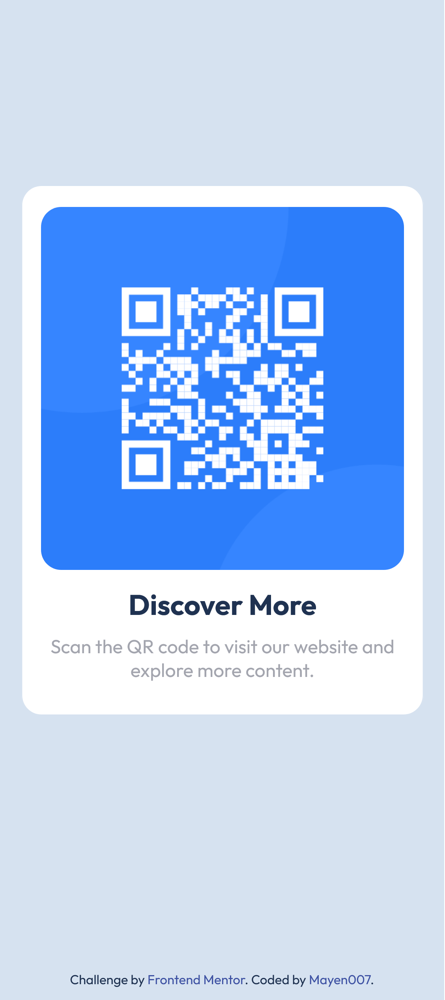

# Frontend Mentor - QR Code Component Solution

This is my solution to the [QR code component challenge on Frontend Mentor](https://www.frontendmentor.io/challenges/qr-code-component-iux_sIO_H). This challenge helped me practice and improve my skills in HTML, CSS, and accessibility.

## Table of Contents

- [Overview](#overview)
  - [Screenshot](#screenshot)
  - [Links](#links)
- [My Process](#my-process)
  - [Built With](#built-with)
  - [What I Learned](#what-i-learned)
  - [Continued Development](#continued-development)
  - [Useful Resources](#useful-resources)
- [Author](#author)

## Overview

### Screenshot

 [QR Code Component Screenshot - Desktop](./assets/images/desktop-view.png)


### Links

- [Solution URL](https://www.frontendmentor.io/solutions/qr-code-component-with-css-cxsGcXbz99) - Frontend Mentor
- [Live Site URL](https://mayen007.github.io/QR-Code-Component/) - GitHub Pages

## My Process

### Built With

- Semantic HTML5 markup
- CSS custom properties
- Mobile-first workflow
- Accessibility improvements (ARIA labels, alt attributes)

### What I Learned

This project reinforced my understanding of HTML and CSS, and I also gained new insights into making content more accessible. Key points include:

- Adding ARIA attributes like `aria-labelledby` and `aria-describedby` for screen readers.
- Using CSS custom properties for color variables to maintain a consistent theme.
- Implementing a responsive layout without using frameworks or Flexbox.

Example of CSS for responsive layout and styling:

```css
.container {
  max-width: 375px;
  margin: 0 auto;
  padding: 1rem;
  background-color: var(--white);
  border-radius: 17px;
  position: relative;
  top: 50%;
  left: 50%;
  transform: translate(-50%, -50%);
}
```

### Continued Development

For future projects, I want to keep improving my understanding of responsive design and focus more on accessible practices. I also aim to explore CSS Grid to expand my layout options.

### Useful Resources

- [The Markdown Guide](https://www.markdownguide.org/) - This guide was helpful in structuring this README file.
- [CSS-Tricks - ARIA and Accessibility](https://css-tricks.com/accessible-simple-responsive-design/) - This article offered useful tips for accessibility.

## Author

- GitHub - [Mayen007](https://github.com/Mayen007)
- Frontend Mentor - [@Mayen007](https://www.frontendmentor.io/profile/Mayen007)
